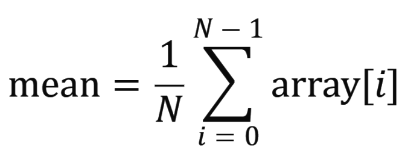
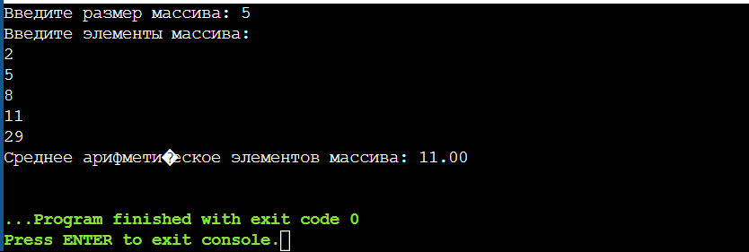
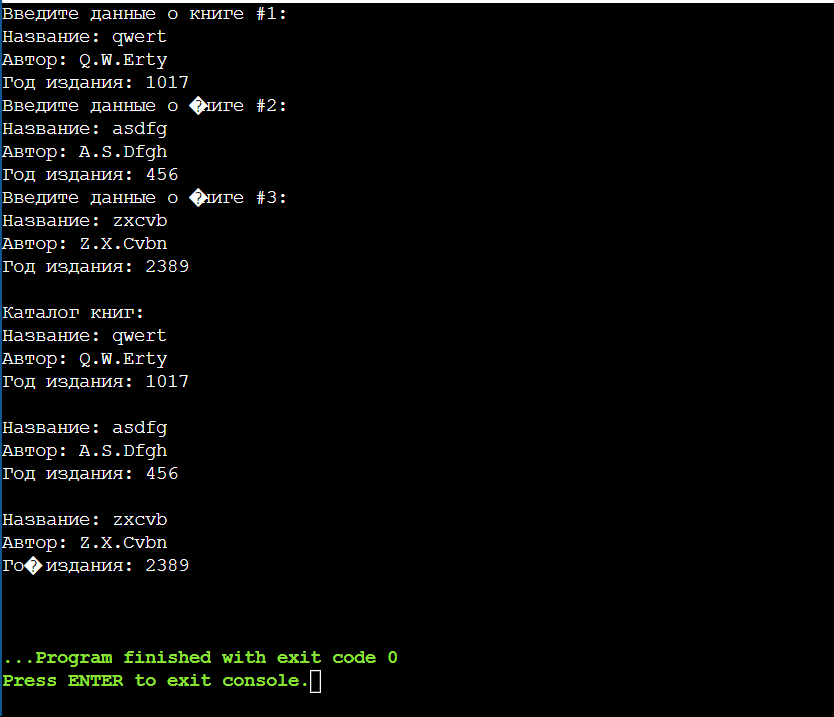

# Отчет по самостоятельной работе №1

## Тема: Структуры. Объединения. Перечисления.

### Задача 1. Динамический массив и вычисление среднего арифметического

#### Постановка задачи

Написать программу на языке Си, которая:
1. Запрашивает у пользователя количество элементов массива (целое число N).
2. Динамически выделяет память для массива из N элементов типа `float`.
3. Заполняет массив значениями, введёнными с клавиатуры.
4. Вычисляет и выводит среднее арифметическое всех элементов массива.
5. Использует арифметику указателей (без оператора `[ ]`) для обращения к элементам массива.
6. Освобождает выделенную память в конце работы программы.

#### Математическая модель

Среднее арифметическое элементов массива вычисляется по формуле:  




#### Список идентификаторов

| Идентификатор | Тип данных | Описание                                 |
|---------------|------------|------------------------------------------|
| `n`           | `int`      | Количество элементов массива             |
| `arr`         | `float*`   | Указатель на динамический массив         |
| `sum`         | `float`    | Сумма элементов массива                  |
| `mean_val`    | `float`    | Среднее арифметическое элементов массива |

#### Код программы

```c
#include <stdio.h> 
#include <stdlib.h> 

float mean(float *p, int n) 
{  
    float sum = 0.0, mean_val; 
    for (int i = 0; i < n; i++) 
    {
        sum = sum + *(p + i); 
    }
    mean_val = sum / n;
    return mean_val;  
}
int main() 
{
    int n;  
    float *arr, m;
    printf("Введите размер массива: ");
    scanf("%d", &n);  
    arr = (float *)malloc(n * sizeof(float));
    if (arr == NULL) 
    {
        printf("Ошибка выделения памяти!\n");
        return 1;
    }
    printf("Введите элементы массива:\n");
    for (int i = 0; i < n; i++) 
    {
        scanf("%f", arr + i); 
    }
    m = mean(arr, n); 
    printf("Среднее арифметическое элементов массива: %.2f\n", m);
    free(arr);
    return 0;
}
```

#### Результат работы программы



---

### Задача 2. Каталог книг

#### Постановка задачи

Создать структуру `Book`, содержащую поля:
- `title` — название книги (максимум 50 символов),
- `author` — имя автора (максимум 50 символов),
- `year` — год издания книги.

Программа должна:
1. Создать массив из 3-х экземпляров структуры `Book`.
2. Запросить у пользователя данные для каждой книги.
3. Вывести информацию обо всех книгах на экран, используя функцию `printBook()`.

#### Список идентификаторов

| Идентификатор | Тип данных | Описание                     |
|---------------|------------|------------------------------|
| `Book`        | `struct`   | Структура для хранения данных о книге |
| `title`       | `char[50]` | Название книги               |
| `author`      | `char[50]` | Автор книги                  |
| `year`        | `int`      | Год издания книги            |

#### Код программы

```c 
#include <stdio.h>
#include <string.h>

#define MAX_LENGTH 50
#define NUM_BOOKS 3

typedef struct 
{
    char title[MAX_LENGTH];
    char author[MAX_LENGTH];
    int year;
} Book;

void printBook(const Book *book) 
{
    printf("Название: %s\n", book->title);
    printf("Автор: %s\n", book->author);
    printf("Год издания: %d\n\n", book->year);
}

int main() 
{
    Book books[NUM_BOOKS];
    for (int i = 0; i < NUM_BOOKS; i++) 
    {
        printf("Введите данные о книге #%d:\n", i + 1);
        printf("Название: ");
        fgets(books[i].title, MAX_LENGTH, stdin);
        books[i].title[strcspn(books[i].title, "\n")] = '\0';
        printf("Автор: ");
        fgets(books[i].author, MAX_LENGTH, stdin);
        books[i].author[strcspn(books[i].author, "\n")] = '\0';

        do 
        {
            printf("Год издания: ");
            while (scanf("%d", &books[i].year) != 1) 
            {
                printf("Ошибка, введите целое число: ");
                while (getchar() != '\n');
	        }
            while (getchar() != '\n');
            
            if (books[i].year <= 0) 
            {
                printf("Год должен быть положительным, попробуйте еще раз.\n");
            }
        } while (books[i].year <= 0);
    }

    printf("\nКаталог книг:\n");
    for (int i = 0; i < NUM_BOOKS; i++) 
    {
        printBook(&books[i]);
    }
    return 0;
}
```

#### Результат работы программы



---

### Задача 3. Определение сезона по номеру месяца

#### Постановка задачи

Создать перечисление `Season` со значениями: `WINTER`, `SPRING`, `SUMMER`, `AUTUMN`. Программа должна:
1. Запросить у пользователя номер месяца (от 1 до 12).
2. Определить и вывести соответствующий сезон:
   - Зима: декабрь (12), январь (1), февраль (2),
   - Весна: март (3), апрель (4), май (5),
   - Лето: июнь (6), июль (7), август (8),
   - Осень: сентябрь (9), октябрь (10), ноябрь (11).

#### Список идентификаторов

| Идентификатор | Тип данных | Описание                     |
|---------------|------------|------------------------------|
| `Season`      | `enum`     | Перечисление сезонов         |
| `month`       | `int`      | Номер месяца                 |
| `season`      | `Season`   | Текущий сезон                |
| `season_names`| `const char*[]` | Массив названий сезонов |

#### Код программы

```c
#include <stdio.h>

enum Season {
    WINTER,
    SPRING,
    SUMMER,
    AUTUMN
};

int main() 
{
    int month;
    enum Season season;
    const char *season_names[] = {"Зима", "Весна", "Лето", "Осень"};

    do 
    {
        printf("Введите номер месяца (1-12): ");
        scanf("%d", &month);
        
        if (month < 1 || month > 12) 
        {
            printf("Ошибка! Месяц должен быть от 1 до 12.\n");
        }
    } while (month < 1 || month > 12);

    switch (month) 
    {
        case 12:
        case 1:
        case 2:
            season = WINTER;
            break;
        case 3:
        case 4:
        case 5:
            season = SPRING;
            break;
        case 6:
        case 7:
        case 8:
            season = SUMMER;
            break;
        case 9:
        case 10:
        case 11:
            season = AUTUMN;
            break;
    }
    printf("Сезон: %s\n", season_names[season]);
    return 0;
}
```

#### Результат работы программы


--- 

## Информация о студенте:

*Елькин Михаил, 1 курс, ИВТ-1.2.*
