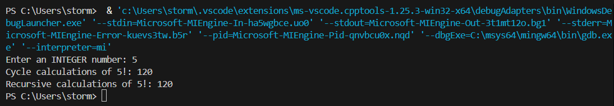
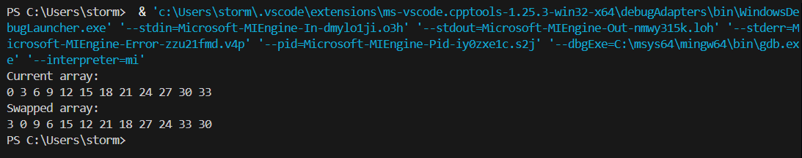
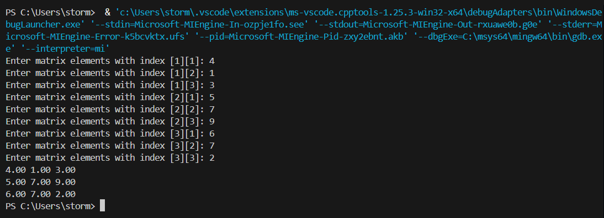
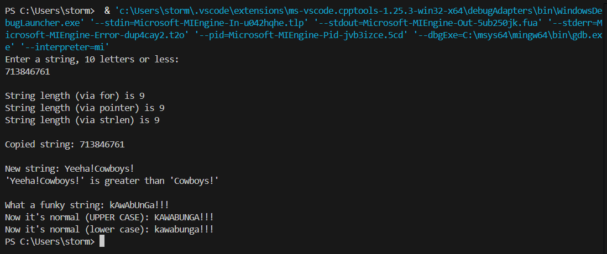
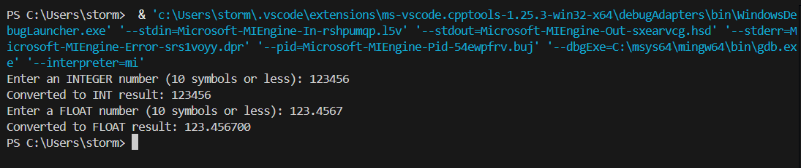
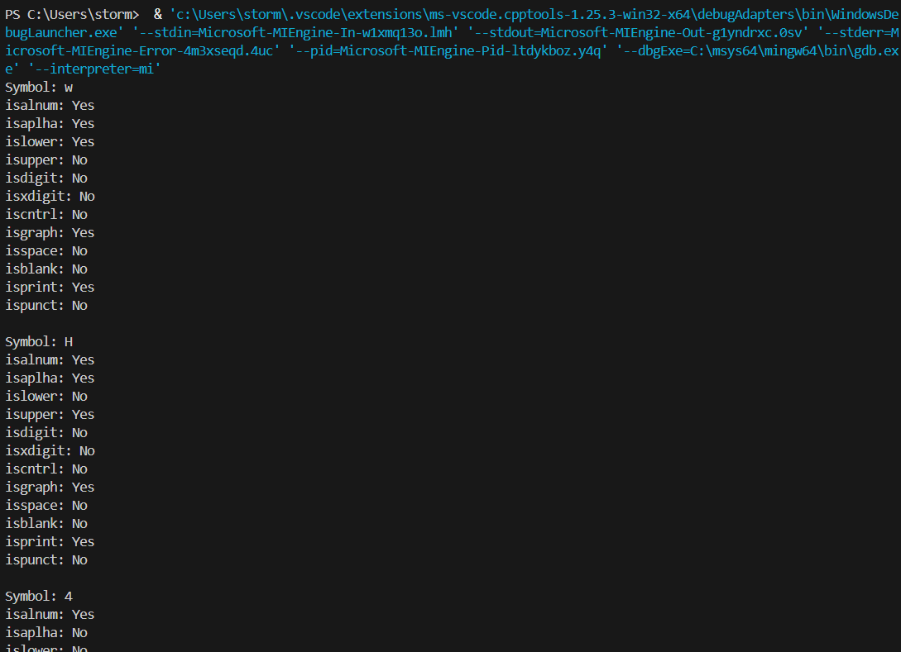

# Лабораторная работа №3
## Тема лабораторной работы: Функции. Базовая работа со строками.

# Комплект 1. Введение в функции

## Задание 1.1
### Постановка задачи:
Создать две функции для вычисления факториала числа: одну с использованием цикла, другую с использованием рекурсии. Продемонстрировать их работу.
### Список идентификаторов:

| **Переменная**      | **Тип** | **Суть**                                                                 |
|---------------------|---------|--------------------------------------------------------------------------|
| `factorialCycle`    | `int(int)` | Функция вычисления факториала циклом                                   |
| `factorialRecursion`| `int(int)` | Функция вычисления факториала рекурсией                               |
| `num`               | `int`   | Входной параметр для функций факториала                                 |
| `res`               | `int`   | Переменная для накопления результата в цикле                            |
| `i`                 | `int`   | Счетчик цикла                                                           |
| `n`                 | `int`   | Введенное пользователем число для вычисления факториала                 |
| `resCycle`          | `int`   | Результат вычисления факториала циклом                                  |
| `resRecursion`      | `int`   | Результат вычисления факториала рекурсией                               |

### Код программы:

```c
#include <stdio.h>

int factorialCycle(int num)
{
    int res = 1;
    for(int i = 2; i <= num; i++)
        res *= i;
    return res;
}
  
int factorialRecursion(int num)
{
    if(num <= 1)
        return 1;
    else return num * factorialRecursion(num - 1);
}
  
int main()
{
    int n;
    printf("Enter an INTEGER number: ");
    scanf("%d", &n);
  
    int resCycle = factorialCycle(n);
    printf("Cycle calculations of %d!: %d\n", n, resCycle);
    int resRecursion = factorialRecursion(n);
    printf("Recursive calculations of %d!: %d\n", n, resRecursion);
  
    return 0;
}
```
### Результаты работы программы:


## Задание 1.2
### Постановка задачи: 
Объявить указатель на массив типа `int`, динамически выделить память для 12 элементов. Написать функцию, которая меняет значения чётных и нечётных ячеек массива.

### Математическая модель:  
swap(a[i], a[i+1]) для i = 0, 2, 4, ..., n-2
### Список идентификаторов:

| **Переменная** | **Тип**           | **Суть**                                                |
| -------------- | ----------------- | ------------------------------------------------------- |
| `swap`         | `void(int*, int)` | Функция для попарной замены элементов массива           |
| `array`        | `int*`            | Указатель на массив (входной параметр функции swap)     |
| `n`            | `int`             | Размер массива (входной параметр функции swap)          |
| `i`            | `int`             | Счетчик цикла в функции swap                            |
| `temp`         | `int`             | Временная переменная для обмена значений                |
| `arr`          | `int*`            | Указатель на динамически выделенный массив в main       |
| `i` (в main)   | `int`             | Счетчик цикла в main для инициализации и вывода массива |

### Код программы:

```c
#include <stdio.h>
#include <stdlib.h>

void swap(int* array, int n)
{
    for(int i = 0; i < n-1; i += 2)
    {
        int temp = array[i];
        array[i] = array[i+1];
        array[i+1] = temp;
    }
}
  
int main()
{
    int n = 12;
  
    int* arr = (int*)malloc(sizeof(int) * n);
    if (arr == NULL)
    {
        printf("Memory allocation error!\n");
        return 1;
    }
  
    for(int i = 0; i < n; i++)
        arr[i] = i * 3;

    printf("Current array:\n");
    for (int i = 0; i < n; i++)
            printf("%d ", arr[i]);
    printf("\n");
  
    swap(arr, n);
    printf("Swapped array:\n");
    for (int i = 0; i < n; i++)
        printf("%d ", arr[i]);
  
    free(arr);
    return 0;
}
```
### Результаты работы программы:


## Задание 1.3
### Постановка задачи: 
Создать функции для динамического выделения и освобождения памяти под двумерный массив типа `double`. Также создать функции для заполнения и вывода матрицы.

### Математическая модель:  
M[i][j] = i + j + 0.5, где i = 0..rows-1, j = 0..cols-1
### Список идентификаторов:

| **Переменная/Функция** | **Тип**                    | **Суть**                                                     |
| ---------------------- | -------------------------- | ------------------------------------------------------------ |
| `matrixMemory`         | `double**(int, int)`       | Функция выделения памяти под матрицу                         |
| `matrixMemoryFree`     | `void(double**, int)`      | Функция освобождения памяти матрицы                          |
| `matrixFill`           | `void(double**, int, int)` | Функция заполнения матрицы значениями с клавиатуры           |
| `matrixPrint`          | `void(double**, int, int)` | Функция вывода матрицы на экран                              |
| `matrix`               | `double**`                 | Двойной указатель для хранения матрицы                       |
| `rows`                 | `int`                      | Количество строк в матрице                                   |
| `cols`                 | `int`                      | Количество столбцов в матрице                                |
| `i`                    | `int`                      | Счетчик строк (используется во всех циклах)                  |
| `j`                    | `int`                      | Счетчик столбцов (используется в циклах заполнения и вывода) |

### Код программы:

```c
#include <stdlib.h>
#include <stdio.h>
  
double** matrixMemory(int rows, int cols)
{
    double **matrix = (double **)malloc(sizeof(double *) * rows);
    for (int i = 0; i < rows; i++)
        matrix[i] = (double *)malloc(sizeof(double) * cols);
  
    return matrix;
}
  
void matrixMemoryFree(double **matrix, int rows)
{
    for (int i = 0; i < rows; i++)
        free(matrix[i]);
  
    free(matrix);
}
  
void matrixFill(double** matrix, int rows, int cols){
    for (int i = 0; i < rows; i++)
    {
        for (int j = 0; j < cols; j++)
        {
            printf("Enter matrix elements with index [%d][%d]: ",i+1,j+1);
            scanf("%lf", &matrix[i][j]);
        }
    }
}
void matrixPrint(double** matrix, int rows, int cols){
    for (int i = 0; i < rows; i++)
    {
        for (int j = 0; j < cols; j++)
            printf("%.2f ", matrix[i][j]);
  
        printf("\n");
    }
}
int main(void)
{
    int rows = 3; int cols = 3;
  
    double** matrix = matrixMemory(rows,cols);
  
    matrixFill(matrix, rows, cols);
    matrixPrint(matrix, rows, cols);
    matrixMemoryFree(matrix, rows);
    return 0;
}
```
### Результаты работы программы:



# Комплект 2. Базовые операции со строками

## Задание 2.1
### Постановка задачи: 
Выполнить базовые операции со строками: вычисление длины, копирование, конкатенация, сравнение, перевод регистра.
### Список идентификаторов:

| **Переменная/Функция** | **Тип**         | **Суть**                                                    |
| ---------------------- | --------------- | ----------------------------------------------------------- |
| `MY_SIZE`              | `#define`       | Макрос, определяющий размер строковых буферов (15 символов) |
| `my_string`            | `char[MY_SIZE]` | Основной строковый буфер для ввода                          |
| `length`               | `int`           | Переменная для хранения длины строки                        |
| `i`                    | `int`           | Счетчик циклов                                              |
| `my_stringPointer`     | `char*`         | Указатель для обхода строки                                 |
| `copy_string`          | `char[MY_SIZE]` | Буфер для копии строки                                      |
| `newString1`           | `char[MY_SIZE]` | Первая строка для конкатенации                              |
| `newString2`           | `char[]`        | Вторая строка для конкатенации                              |
| `result`               | `int`           | Результат сравнения строк                                   |
| `funkyString`          | `char[MY_SIZE]` | Строка для демонстрации изменения регистра                  |
| `fgets`                | `char*(...)`    | Функция безопасного ввода строки                            |
| `strcspn`              | `size_t(...)`   | Функция поиска символа в строке                             |
| `strlen`               | `size_t(...)`   | Функция определения длины строки                            |
| `strncpy`              | `char*(...)`    | Функция безопасного копирования строк                       |
| `strncat`              | `char*(...)`    | Функция безопасной конкатенации строк                       |
| `strncmp`              | `int(...)`      | Функция безопасного сравнения строк                         |
| `toupper`              | `int(...)`      | Функция преобразования символа в верхний регистр            |
| `tolower`              | `int(...)`      | Функция преобразования символа в нижний регистр             |

### Код программы:

```c
#include <string.h>
#include <stdio.h>
#include <ctype.h>
  
#define MY_SIZE 15
  
int main()
{
    // Создание строки
    char my_string[MY_SIZE];
    printf("Enter a string, 10 letters or less:\n");
    fgets(my_string, MY_SIZE, stdin);
    my_string[strcspn(my_string, "\n")] = '\0'; // удаление символа \n в конце строки (замена на \0)
    printf("\n");
  
    // 1. Вычисление длины строки через цикл for
    int length = 0;
    for(int i = 0; my_string[i] != '\0'; i++)
        length++;
    printf("String length (via for) is %d\n", length);
  
    // 2. Вычисление длины строки через указатель
    char* my_stringPointer = my_string;
    length = 0;
  
    while(*my_stringPointer != '\0')
    {
        length++;
        my_stringPointer++;
    }
  
    printf("String length (via pointer) is %d\n", length);
  
    // 3. Вычисление длины строки при помощи функции strlen
    length = strlen(my_string);
    printf("String length (via strlen) is %d\n", length);
  
    // 4. Создание копии строки
    char copy_string[MY_SIZE];
    strncpy(copy_string, my_string, length);
    copy_string[length] = '\0';
    printf("\nCopied string: %s\n\n", copy_string);
  
    // 5. Конкатенация двух строк
    char newString1[MY_SIZE] = "Yeeha!";
    char newString2[] = "Cowboys!";
    strncat(newString1, newString2, sizeof(newString2)-1);
    printf("New string: %s\n", newString1);
  
    // 6. Сравнение строк
    int result = strncmp(newString1, newString2, strlen(newString2));
    if (result == 0)        
        printf("'%s' is equal to '%s' upto %d characters\n",newString1, newString2, strlen(newString2));
    else if (result > 0)
        printf("'%s' is greater than '%s'\n",newString1, newString2);
    else
        printf("'%s' is greater than '%s'\n",newString1, newString2);
  
    // 7. Перевод регистров
    char funkyString[MY_SIZE] = "kAwAbUnGa!!!";
    printf("\nWhat a funky string: %s\n", funkyString);
    for(int i = 0; funkyString[i] != '\0'; i++)
        funkyString[i] = toupper(funkyString[i]);
    printf("Now it's normal (UPPER CASE): %s\n", funkyString);
  
    for(int i = 0; funkyString[i] != '\0'; i++)
        funkyString[i] = tolower(funkyString[i]);
    printf("Now it's normal (lower case): %s", funkyString);
  
    return 0;
}
```
### Результаты работы программы:


## Задание 2.2
### Постановка задачи: 
Конвертировать строки, представляющие числа, в значения типов `double` и `int`.
### Список идентификаторов:

| **Идентификатор** | **Тип**            | **Назначение**                                                                 |
|-------------------|--------------------|-------------------------------------------------------------------------------|
| `SIZE`           | `#define`         | Макрос, определяющий размер буферов ввода (12 символов)                      |
| `intLine`        | `char[SIZE]`      | Буфер для ввода целочисленного значения                                      |
| `floatLine`      | `char[SIZE]`      | Буфер для ввода вещественного значения                                       |
| `fgets`          | `char*(...)`      | Функция безопасного ввода строки с ограничением длины                        |
| `strcspn`        | `size_t(...)`     | Функция поиска символа перевода строки для его замены                        |
| `atoi`           | `int(...)`        | Функция преобразования строки в целое число (ASCII to integer)               |
| `atof`           | `double(...)`     | Функция преобразования строки в вещественное число (ASCII to float)          |

### Код программы:

```c
#include <stdio.h>
#include <stdlib.h>
#include <string.h>
  
#define SIZE 12
  
int main()
{
    char intLine[SIZE];
    char floatLine[SIZE];
  
    printf("Enter an INTEGER number (10 symbols or less): ");
    fgets(intLine, SIZE, stdin);
    intLine[strcspn(intLine, "\n")] = '\0';
    printf("Converted to INT result: %d\n", atoi(intLine));
  
    printf("Enter a FLOAT number (10 symbols or less): ");
    fgets(floatLine, SIZE, stdin);
    floatLine[strcspn(floatLine, "\n")] = '\0';
    printf("Converted to FLOAT result: %f", atof(floatLine));

    return 0;
}
```
### Результаты работы программы:



## Задание 2.3
### Постановка задачи: 
Создать строку и проанализировать каждый символ с помощью функций типа `isalpha`, `isdigit` и т.д.
### Список идентификаторов:

| **Идентификатор** | **Тип**        | **Назначение**                                                                 |
|-------------------|---------------|-------------------------------------------------------------------------------|
| `string`         | `char[]`      | Массив символов для тестирования функций проверки символов                   |
| `i`              | `int`         | Счетчик цикла для перебора символов строки                                    |
| `isalnum`        | `int(int)`    | Проверяет, является ли символ буквенно-цифровым (A-Z, a-z, 0-9)              |
| `isalpha`        | `int(int)`    | Проверяет, является ли символ буквой (A-Z, a-z)                              |
| `islower`        | `int(int)`    | Проверяет, является ли символ строчной буквой (a-z)                          |
| `isupper`        | `int(int)`    | Проверяет, является ли символ заглавной буквой (A-Z)                         |
| `isdigit`        | `int(int)`    | Проверяет, является ли символ цифрой (0-9)                                   |
| `isxdigit`       | `int(int)`    | Проверяет, является ли символ шестнадцатеричной цифрой (0-9, A-F, a-f)       |
| `iscntrl`        | `int(int)`    | Проверяет, является ли символ управляющим (ASCII 0-31, 127)                  |
| `isgraph`        | `int(int)`    | Проверяет, является ли символ печатаемым (кроме пробела)                     |
| `isspace`        | `int(int)`    | Проверяет, является ли символ пробельным (пробел, \t, \n и др.)              |
| `isblank`        | `int(int)`    | Проверяет, является ли символ пробелом или табуляцией                        |
| `isprint`        | `int(int)`    | Проверяет, является ли символ печатаемым (включая пробел)                    |
| `ispunct`        | `int(int)`    | Проверяет, является ли символ знаком пунктуации (кроме букв, цифр и пробелов)|

### Код программы:

```c
#include <stdio.h>
#include <ctype.h>
  
int main(void){
    char string[] = "wH4t (?!)";
  
    for(int i = 0; string[i] != '\0'; i++){
        printf("Symbol: %c\n", string[i]);
        printf("isalnum: %s", (isalnum(string[i]) == 0 ? "No\n" : "Yes\n" ));
        printf("isaplha: %s", (isalpha(string[i]) == 0 ? "No\n" : "Yes\n" ));
        printf("islower: %s", (islower(string[i]) == 0 ? "No\n" : "Yes\n" ));
        printf("isupper: %s", (isupper(string[i]) == 0 ? "No\n" : "Yes\n" ));
        printf("isdigit: %s", (isdigit(string[i]) == 0 ? "No\n" : "Yes\n" ));
        printf("isxdigit: %s", (isxdigit(string[i]) == 0 ? "No\n" : "Yes\n" ));
        printf("iscntrl: %s", (iscntrl(string[i]) == 0 ? "No\n" : "Yes\n" ));
        printf("isgraph: %s", (isgraph(string[i]) == 0 ? "No\n" : "Yes\n" ));
        printf("isspace: %s", (isspace(string[i]) == 0 ? "No\n" : "Yes\n" ));
        printf("isblank: %s", (isblank(string[i]) == 0 ? "No\n" : "Yes\n" ));
        printf("isprint: %s", (isprint(string[i]) == 0 ? "No\n" : "Yes\n" ));
        printf("ispunct: %s", (ispunct(string[i]) == 0 ? "No\n\n" : "Yes\n\n" ));
    }
}
```
### Результаты работы программы:


