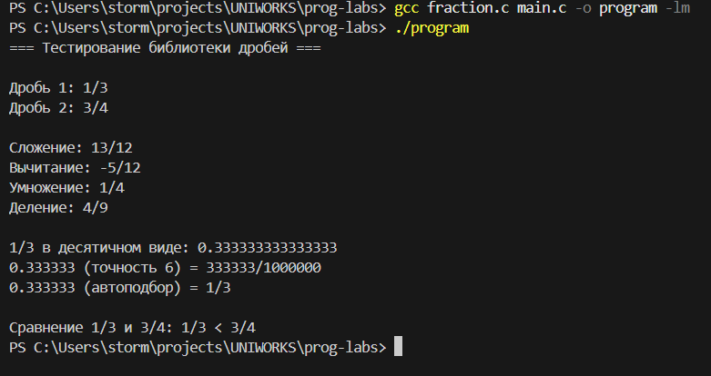

# Проект: Библиотека для работы с дробями
### 1. Заголовочный файл (fraction.h)

```c
#ifndef FRACTION_H
#define FRACTION_H

#include <stdbool.h>

typedef struct {
    int numerator;   // числитель
    int denominator; // знаменатель
} Fraction;

// Создание и вывод дроби
Fraction create_fraction(int num, int den);
void print_fraction(Fraction f);

// Арифметические операции
Fraction add_fractions(Fraction a, Fraction b);
Fraction subtract_fractions(Fraction a, Fraction b);
Fraction multiply_fractions(Fraction a, Fraction b);
Fraction divide_fractions(Fraction a, Fraction b);

// Преобразования
double fraction_to_decimal(Fraction f);
Fraction decimal_to_fraction(double decimal, int precision);
Fraction decimal_to_fraction_precise(double decimal, double tolerance);

// Утилиты
Fraction reduce_fraction(Fraction f);
int compare_fractions(Fraction a, Fraction b);
int find_gcd(int a, int b);

#endif // FRACTION_H
```

### 2. Полная реализация функций (fraction.c)

```c
#include "fraction.h"
#include <stdio.h>
#include <stdlib.h>
#include <math.h>

// Создание дроби с проверкой знаменателя
Fraction create_fraction(int num, int den) {
    Fraction f;
    if (den == 0) {
        printf("Ошибка! Знаменатель не может быть равен нулю\n");
        f.numerator = 0;
        f.denominator = 1;
        return f;
    }
    
    f.numerator = num;
    f.denominator = den;
    
    // Нормализация знака
    if (f.denominator < 0) {
        f.numerator *= -1;
        f.denominator *= -1;
    }
    
    return reduce_fraction(f);
}

// Нахождение НОД (алгоритм Евклида)
int find_gcd(int a, int b) {
    a = abs(a);
    b = abs(b);
    while (b != 0) {
        int temp = b;
        b = a % b;
        a = temp;
    }
    return a;
}

// Сокращение дроби
Fraction reduce_fraction(Fraction f) {
    if (f.numerator == 0) {
        f.denominator = 1;
        return f;
    }
    
    int gcd = find_gcd(f.numerator, f.denominator);
    f.numerator /= gcd;
    f.denominator /= gcd;
    
    // Повторная нормализация знака
    if (f.denominator < 0) {
        f.numerator *= -1;
        f.denominator *= -1;
    }
    
    return f;
}

// Вывод дроби
void print_fraction(Fraction f) {
    if (f.denominator == 1) {
        printf("%d", f.numerator);
    } else {
        printf("%d/%d", f.numerator, f.denominator);
    }
}

// Сложение дробей
Fraction add_fractions(Fraction a, Fraction b) {
    Fraction result;
    result.numerator = a.numerator * b.denominator + b.numerator * a.denominator;
    result.denominator = a.denominator * b.denominator;
    return reduce_fraction(result);
}

// Вычитание дробей
Fraction subtract_fractions(Fraction a, Fraction b) {
    Fraction result;
    result.numerator = a.numerator * b.denominator - b.numerator * a.denominator;
    result.denominator = a.denominator * b.denominator;
    return reduce_fraction(result);
}

// Умножение дробей
Fraction multiply_fractions(Fraction a, Fraction b) {
    Fraction result;
    result.numerator = a.numerator * b.numerator;
    result.denominator = a.denominator * b.denominator;
    return reduce_fraction(result);
}

// Деление дробей
Fraction divide_fractions(Fraction a, Fraction b) {
    if (b.numerator == 0) {
        printf("Ошибка: деление на ноль!\n");
        return create_fraction(0, 1);
    }
    
    Fraction result;
    result.numerator = a.numerator * b.denominator;
    result.denominator = a.denominator * b.numerator;
    return reduce_fraction(result);
}

// Сравнение дробей
int compare_fractions(Fraction a, Fraction b) {
    Fraction diff = subtract_fractions(a, b);
    if (diff.numerator > 0) return 1;
    if (diff.numerator < 0) return -1;
    return 0;
}

// Преобразование дроби в десятичное число
double fraction_to_decimal(Fraction f) {
    if (f.denominator == 0) {
        printf("Ошибка: деление на ноль!\n");
        return NAN;
    }
    return (double)f.numerator / f.denominator;
}

// Преобразование десятичного числа в дробь (фиксированная точность)
Fraction decimal_to_fraction(double decimal, int precision) {
    if (precision < 0 || precision > 10) {
        printf("Точность должна быть от 0 до 10\n");
        return create_fraction(0, 1);
    }

    int sign = decimal < 0 ? -1 : 1;
    decimal = fabs(decimal);
    long denominator = (long)pow(10, precision);
    long numerator = (long)round(decimal * denominator);

    return create_fraction(sign * numerator, denominator);
}

// Преобразование с автоматическим подбором знаменателя
Fraction decimal_to_fraction_precise(double decimal, double tolerance) {
    double best_error = INFINITY;
    Fraction best_fraction = {0, 1};
    
    for (int denom = 1; denom <= 10000; denom++) {
        int numer = (int)round(decimal * denom);
        double current = (double)numer / denom;
        double error = fabs(current - decimal);
        
        if (error < best_error) {
            best_error = error;
            best_fraction = create_fraction(numer, denom);
            if (error <= tolerance) break;
        }
    }
    
    return best_fraction;
}
```

### 3. Демонстрационная программа (main.c)

```c
#include "fraction.h"
#include <stdio.h>

int main() {
    printf("=== Тестирование библиотеки дробей ===\n\n");
    
    // Создание дробей
    Fraction f1 = create_fraction(1, 3);
    Fraction f2 = create_fraction(3, 4);
    
    printf("Дробь 1: ");
    print_fraction(f1);
    printf("\nДробь 2: ");
    print_fraction(f2);
    printf("\n\n");
    
    // Арифметические операции
    printf("Сложение: ");
    print_fraction(add_fractions(f1, f2));
    printf("\n");
    
    printf("Вычитание: ");
    print_fraction(subtract_fractions(f1, f2));
    printf("\n");
    
    printf("Умножение: ");
    print_fraction(multiply_fractions(f1, f2));
    printf("\n");
    
    printf("Деление: ");
    print_fraction(divide_fractions(f1, f2));
    printf("\n\n");
    
    // Преобразования
    printf("1/3 в десятичном виде: %.15f\n", fraction_to_decimal(f1));
    
    Fraction f3 = decimal_to_fraction(0.333333, 6);
    printf("0.333333 (точность 6) = ");
    print_fraction(f3);
    printf("\n");
    
    Fraction f4 = decimal_to_fraction_precise(0.333333, 0.0001);
    printf("0.333333 (автоподбор) = ");
    print_fraction(f4);
    printf("\n\n");
    
    // Сравнение
    printf("Сравнение 1/3 и 3/4: ");
    int cmp = compare_fractions(f1, f2);
    if (cmp > 0) printf("1/3 > 3/4\n");
    else if (cmp < 0) printf("1/3 < 3/4\n");
    else printf("1/3 == 3/4\n");
    
    return 0;
}
```

### Пример вывода программы:

