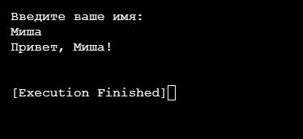
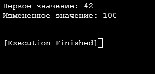
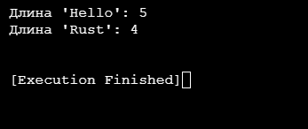
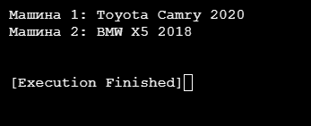
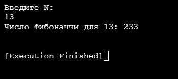
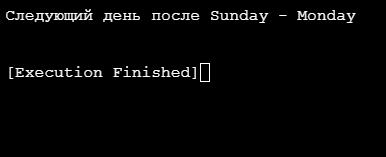
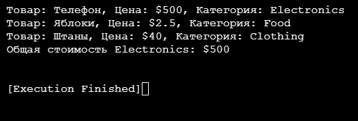
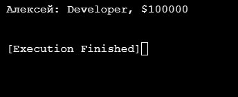

## 1. Приветствие пользователя
### Постановка задачи:
Напишите программу, которая запрашивает у пользователя имя и выводит на экран приветственное сообщение с использованием этого имени. 

### Список идентификаторов:

| Идентификатор | Тип            | Назначение                                                             |
| ------------- | -------------- | ---------------------------------------------------------------------- |
| `io`          | Модуль std::io | Модуль для работы с вводом-выводом                                     |
| `main`        | Функция        | Главная функция программы (точка входа)                                |
| `println!`    | Макрос         | Вывод форматированной строки в консоль                                 |
| `String::new` | Конструктор    | Создает новую пустую строку типа String                                |
| `name`        | `mut String`   | Переменная для хранения введенного имени (изменяемая)                  |
| `stdin`       | Функция        | Получает handle для стандартного ввода                                 |
| `read_line`   | Метод          | Читает строку из ввода и сохраняет в указанную переменную              |
| `expect`      | Метод          | Обрабатывает возможные ошибки (выводит сообщение при их возникновении) |
| `trim`        | Метод          | Удаляет пробельные символы и переводы строк в начале и конце строки    |

### Код программы:

```rust
use std::io;

fn main() {
    println!("Введите ваше имя:");
    let mut name = String::new();
    io::stdin().read_line(&mut name).expect("Ошибка чтения");
    println!("Привет, {}!", name.trim());
}
```
### Результаты работы программы:



## 2. Работа с беззнаковым целым числом
### Постановка задачи:
Создайте переменную типа целое беззнаковое число и выведите ее значение на экран. Явно укажите тип переменной. Затем измените значение переменной и снова выведите его. 

### Список идентификаторов:

| **Идентификатор** | **Тип**   | **Суть**                         |
| ----------------- | --------- | -------------------------------- |
| `main`            | Функция   | Главная функция программы        |
| `num`             | `mut u32` | Изменяемая переменная типа `u32` |
| `println!`        | Макрос    | Форматированный вывод в консоль  |

### Код программы:


```rust
fn main() {
    let mut num: u32 = 42;
    println!("Первое значение: {}", num);
    num = 100;
    println!("Измененное значение: {}", num);
}
```

### Результаты работы программы:



## 3. Функция для подсчета длины строки
### Постановка задачи:
Напишите функцию, которая принимает строку и возвращает ее длину (количество символов). Затем вызовите эту функцию с различными строками.  

### Список идентификаторов:

| Идентификатор  | Тип                  | Назначение                                 |
|----------------|----------------------|--------------------------------------------|
| `string_length`| Функция              | Функция для вычисления длины строки        |
| `s`            | `&str`               | Параметр функции - ссылка на строковый срез|
| `usize`        | Тип данных           | Тип возвращаемого значения (размер строки) |
| `len`          | Метод типа `str`     | Возвращает длину строкового среза          |
| `main`         | Функция              | Главная функция программы                  |
| `println!`     | Макрос               | Вывод данных в консоль                     |

### Код программы:

```rust
fn string_length(s: &str) -> usize {
    s.len()
}

fn main() {
    println!("Длина 'Hello': {}", string_length("Hello"));
    println!("Длина 'Rust': {}", string_length("Rust"));
}
```

### Результаты работы программы:



## 4. Структура Car
### Постановка задачи:
Задайте структуру Car с полями brand, model и year, и создайте несколько экземпляров этой структуры. Выведите информацию о каждой машине на экран. 
### Список идентификаторов:

| **Идентификатор** | **Тип**     | **Суть**                                 |
| ----------------- | ----------- | ---------------------------------------- |
| `Car`             | `struct`    | Структура, описывающая автомобиль        |
| `brand`           | `String`    | Поле структуры: марка автомобиля         |
| `model`           | `String`    | Поле структуры: модель автомобиля        |
| `year`            | `u16`       | Поле структуры: год выпуска              |
| `main`            | Функция     | Главная функция программы                |
| `car1`            | `Car`       | Экземпляр структуры `Car`                |
| `car2`            | `Car`       | Экземпляр структуры `Car`                |
| `println!`        | Макрос      | Форматированный вывод в консоль          |
| `String::from`    | Конструктор | Создание `String` из строкового литерала |
### Код программы:

```rust
struct Car {
    brand: String,
    model: String,
    year: u16,
}

fn main() {
    let car1 = Car {
        brand: String::from("Toyota"),
        model: String::from("Camry"),
        year: 2020,
    };
    
    let car2 = Car {
        brand: String::from("BMW"),
        model: String::from("X5"),
        year: 2018,
    };
    
    println!("Машина 1: {} {} {}", car1.brand, car1.model, car1.year);
    println!("Машина 2: {} {} {}", car2.brand, car2.model, car2.year);
}
```

### Результаты работы программы:



## 5. Число Фибоначчи 
### Постановка задачи:
Напишите программу, которая запрашивает у пользователя число 𝑁 и выводит на экран 𝑁­ное число Фибоначчи. Используйте рекурсию для решения этой задачи. 

### Список идентификаторов:

| Идентификатор    | Тип               | Назначение                                          |
| ---------------- | ----------------- | --------------------------------------------------- |
| `fibonacci`      | Функция           | Рекурсивная функция вычисления чисел Фибоначчи      |
| `n`              | `u32`             | Аргумент функции - номер числа в последовательности |
| `match`          | Конструкция языка | Сопоставление с образцом                            |
| `main`           | Функция           | Главная функция программы                           |
| `input`          | `mut String`      | Переменная для хранения пользовательского ввода     |
| `std::io::stdin` | Модуль            | Функционал для работы со стандартным вводом         |
| `println!`       | Макрос            | Форматированный вывод в консоль                     |
### Код программы:

```rust
fn fibonacci(n: u32) -> u32 {
    match n {
        0 => 0,
        1 => 1,
        _ => fibonacci(n - 1) + fibonacci(n - 2),
    }
}

fn main() {
    let mut input = String::new();
    println!("Введите N:");
    std::io::stdin().read_line(&mut input).expect("Ошибка");
    let n: u32 = input.trim().parse().expect("Не число");
    println!("Число Фибоначчи для {}: {}", n, fibonacci(n));
}
```

### Результаты работы программы:



## 6. Дни недели
### Постановка задачи:
Реализуйте перечисление DayOfWeek для дней недели. Напишите функцию, которая принимает день недели и возвращает следующий день. Обработайте случаи перехода на следующий день недели, если текущий день – воскресенье. 

### Список идентификаторов:

| Идентификатор      | Тип                    | Назначение                                |
| ------------------ | ---------------------- | ----------------------------------------- |
| `DayOfWeek`        | `enum`                 | Перечисление дней недели                  |
| `Monday`..`Sunday` | Варианты enum          | Конкретные значения перечисления          |
| `#[derive(Debug)]` | Атрибут                | Автоматически реализует трейт Debug       |
| `next_day`         | Функция                | Возвращает следующий день недели          |
| `day`              | Параметр (DayOfWeek)   | Принимает день недели                     |
| `match`            | Конструкция            | Сопоставление с образцом                  |
| `main`             | Функция                | Точка входа программы                     |
| `today`            | Переменная (DayOfWeek) | Хранит текущий день                       |
| `println!`         | Макрос                 | Форматированный вывод с дебаг-информацией |

### Код программы:

```rust
#[derive(Debug, Clone, Copy)]  
enum DayOfWeek {
    Monday,
    Tuesday,
    Wednesday,
    Thursday,
    Friday,
    Saturday,
    Sunday,
}

fn next_day(day: DayOfWeek) -> DayOfWeek {
    match day {
        DayOfWeek::Monday => DayOfWeek::Tuesday,
        DayOfWeek::Tuesday => DayOfWeek::Wednesday,
        DayOfWeek::Wednesday => DayOfWeek::Thursday,
        DayOfWeek::Thursday => DayOfWeek::Friday,
        DayOfWeek::Friday => DayOfWeek::Saturday,
        DayOfWeek::Saturday => DayOfWeek::Sunday,
        DayOfWeek::Sunday => DayOfWeek::Monday,
    }
}

fn main() {
    let today = DayOfWeek::Sunday;
    println!("Следующий день после {:?} - {:?}", today, next_day(today));
}
```

### Результаты работы программы:



## 7. Структура Product
### Постановка задачи:
Создайте структуру Product с полями name, price и category, а также перечисление (enum) Category для категорий товаров. Напишите метод для вывода информации о продукте и ассоциированную функцию для подсчета общей суммы товаров в заданной категории из массива продуктов. 

### Список идентификаторов:

| Идентификатор  | Тип               | Назначение                                |
| -------------- | ----------------- | ----------------------------------------- |
| `Category`     | `enum`            | Перечисление категорий товаров            |
| `Product`      | `struct`          | Структура, описывающая товар              |
| `name`         | Поле (`String`)   | Название товара                           |
| `price`        | Поле (`f64`)      | Цена товара                               |
| `category`     | Поле (`Category`) | Категория товара                          |
| `impl Product` | Блок реализации   | Реализация методов для `Product`          |
| `total_price`  | Статический метод | Считает общую стоимость товаров категории |
| `products`     | `Vec<Product>`    | Вектор товаров                            |
| `filter()`     | Метод итератора   | Фильтрует товары по категории             |
| `map()`        | Метод итератора   | Преобразует товар в его цену              |
| `sum()`        | Метод итератора   | Суммирует цены                            |
| `matches!`     | Макрос            | Сравнивает значение с образцом            |

### Код программы:

```rust
#[derive(Debug, PartialEq, Clone, Copy)] 
enum Category {
    Electronics,
    Food,
    Clothing,
}

struct Product {
    name: String,
    price: f64,
    category: Category,
}

impl Product {
    fn print_info(&self) {
        println!("Товар: {}, Цена: ${}, Категория: {:?}", 
            self.name, self.price, self.category);
    }
    
    fn total_price(products: &[Product], category: Category) -> f64 {
        products.iter()
            .filter(|p| p.category == category)
            .map(|p| p.price)
            .sum()
    }
}

fn main() {
    let products = vec![
        Product {
            name: String::from("Телефон"),
            price: 500.0,
            category: Category::Electronics,
        },
        Product {
            name: String::from("Яблоки"),
            price: 2.5,
            category: Category::Food,
        },
        Product {
            name: String::from("Штаны"),
            price: 40.0,
            category: Category::Clothing,
        },
    ];
    
    // Вывод информации о всех товарах
    for product in &products {
        product.print_info();
    }
    
    // Расчет для нужной категории (здесь Electronics)
    let target_category = Category::Electronics;
    let total = Product::total_price(&products, target_category);
    println!("Общая стоимость {:?}: ${}", target_category, total);
}
```

### Результаты работы программы:



## 8. Структура Employee
### Постановка задачи:
Создайте структуру Employee с полями name, position, salary, а также перечисление Position для должностей сотрудников. Напишите функцию, которая принимает вектор сотрудников и возвращает вектор сотрудников заданной должности.

### Список идентификаторов:

| Идентификатор        | Тип                        | Назначение                           |
| -------------------- | -------------------------- | ------------------------------------ |
| `Position`           | `enum`                     | Перечисление должностей              |
| `Manager`            | Вариант enum               | Должность "Менеджер"                 |
| `Developer`          | Вариант enum               | Должность "Разработчик"              |
| `Designer`           | Вариант enum               | Должность "Дизайнер"                 |
| `Employee`           | `struct`                   | Структура сотрудника                 |
| `name`               | Поле (`String`)            | Имя сотрудника                       |
| `position`           | Поле (`Position`)          | Должность сотрудника                 |
| `salary`             | Поле (`u32`)               | Зарплата сотрудника                  |
| `filter_by_position` | Функция                    | Фильтрует сотрудников по должности   |
| `employees`          | Параметр (`Vec<Employee>`) | Входной вектор сотрудников           |
| `position`           | Параметр (`Position`)      | Должность для фильтрации             |
| `into_iter()`        | Метод                      | Преобразует вектор в итератор        |
| `filter()`           | Метод итератора            | Фильтрует элементы по условию        |
| `collect()`          | Метод итератора            | Собирает результаты в коллекцию      |
| `employees`          | `Vec<Employee>`            | Вектор сотрудников                   |
| `developers`         | `Vec<Employee>`            | Отфильтрованный вектор разработчиков |
| `println!`           | Макрос                     | Форматированный вывод                |

### Код программы:

```rust
#[derive(Debug, PartialEq)]
enum Position {
    Manager,
    Developer,
    Designer,
}

struct Employee {
    name: String,
    position: Position,
    salary: u32,
}

fn filter_by_position(employees: Vec<Employee>, position: Position) -> Vec<Employee> {
    employees.into_iter()
        .filter(|e| e.position == position)
        .collect()
}

fn main() {
    let employees = vec![
        Employee {
            name: String::from("Алексей"),
            position: Position::Developer,
            salary: 100000,
        },
        Employee {
            name: String::from("Мария"),
            position: Position::Manager,
            salary: 120000,
        },
    ];
    
    let developers = filter_by_position(employees, Position::Developer);
    for dev in developers {
        println!("{}: {:?}, ${}", dev.name, dev.position, dev.salary);
    }
}
```

### Результаты работы программы:


